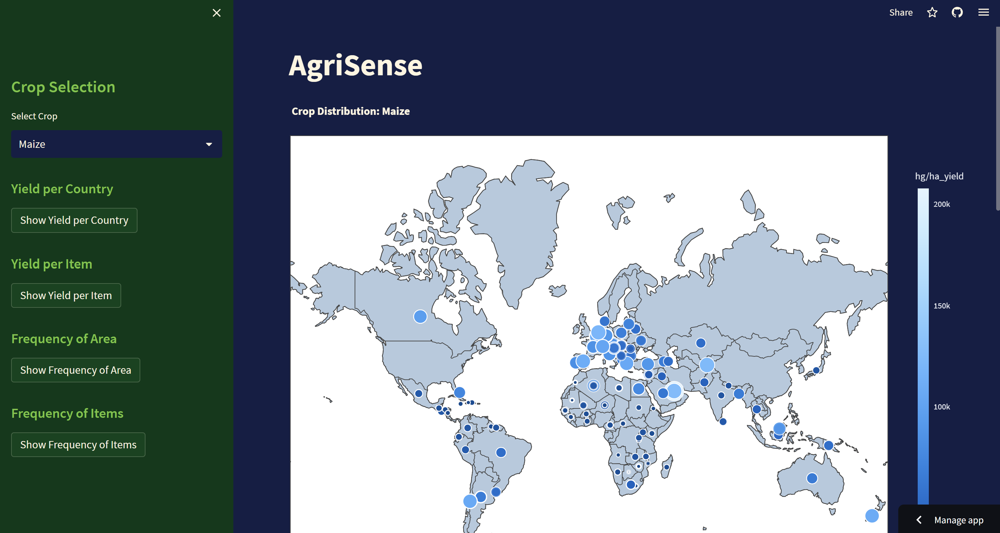
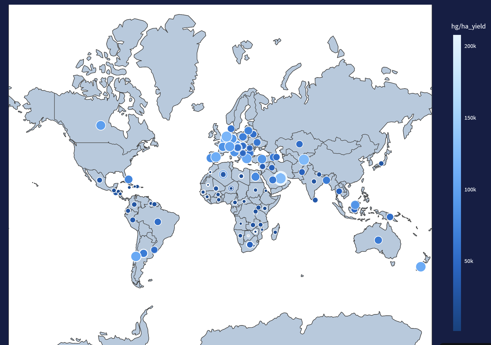
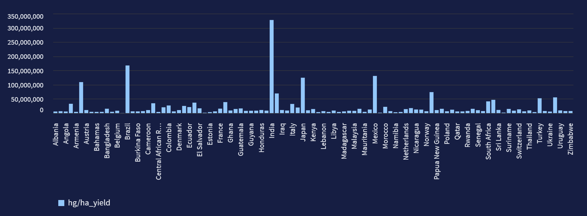
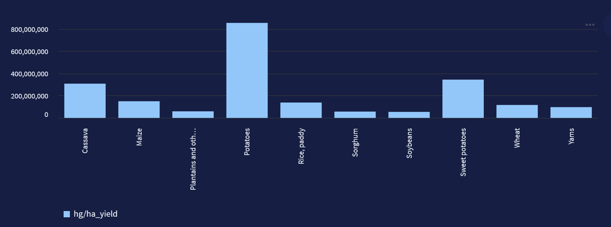
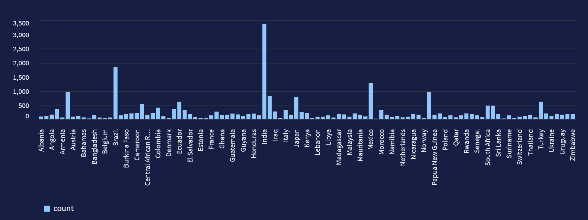
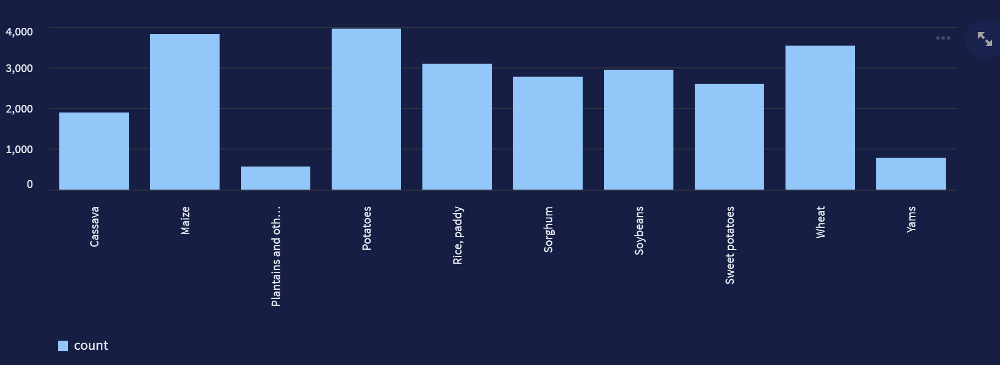

# AGRISENSE

AGRISENSE is a web application designed for farmers to help them analyze and predict crop yields based on various agricultural attributes. This README file provides an overview of the features and functionalities of the AGRISENSE repository.

## Features

### Crop Yield Prediction
- Farmers can predict crop yields based on the following attributes:
  - Year
  - Average Rainfall
  - Country/Area
  - Pesticides Usage
  - Average Temperature
  - Crop Item

### Interactive World Map
- Users can visualize crop distribution across different countries using an interactive world map.

### Graphical Analysis
- The application provides graphical analysis in the form of charts for:
  - Yield per Country
  - Yield per Crop Item
  - Frequency of Area
  - Frequency of Crop Items
  
### Predicted Yield Display
- Upon clicking the prediction button, the application displays the predicted yield based on the input provided by the user.

## Usage

To use AGRISENSE, follow these steps:
1. Clone the repository to your local machine.
2. Install the required dependencies using `pip install -r requirements.txt`.
3. Run the Streamlit application by executing `streamlit run agrisense.py`.
4. Access the application through the provided URL in your web browser.

## Screenshots

*Figure 1: Interactive World Map showing Crop Distribution*

*Figure 2: Yield per Country Chart*

*Figure 3: Yield per Crop Item Chart*

*Figure 4: Frequency of Area Chart*

*Figure 5: Frequency of Crop Items Chart*

### Website Link
[AGRISENSE](https://agrisensa.streamlit.app/)

- [Vishnu Padmakumar]
- [vishnu.padmakumar1493@gmail.com]

